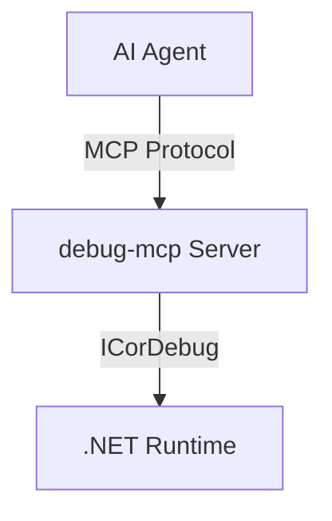

# Quickstart: Documentation Improvement

## Prerequisites

- Node.js 22+ (for Docusaurus)
- asciinema CLI (`pacman -S asciinema`)
- debug-mcp.net repo checked out on `012-docs-improvement` branch

## Setup

```bash
cd website
npm install
```

## Development Workflow

### Run docs locally

```bash
npm start
# Opens http://localhost:3000
```

### Verify build

```bash
npm run build
```

### Record an asciinema session

```bash
asciinema rec static/casts/my-session.cast --idle-time-limit 2 --title "My Session"
# ... perform debugging workflow ...
# Ctrl+D to stop
```

### Embed recording in a doc page

```mdx
import AsciinemaPlayer from '@site/src/components/AsciinemaPlayer';

<AsciinemaPlayer src="/casts/my-session.cast" idleTimeLimit={3} speed={1.5} />
```

### Add a Mermaid diagram

````markdown

````

## Validation

- `npm run build` must succeed with zero errors
- All Mermaid diagrams render in both light and dark mode
- All asciinema players load and play
- No broken links in sidebar navigation
