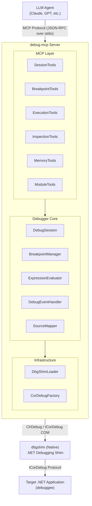
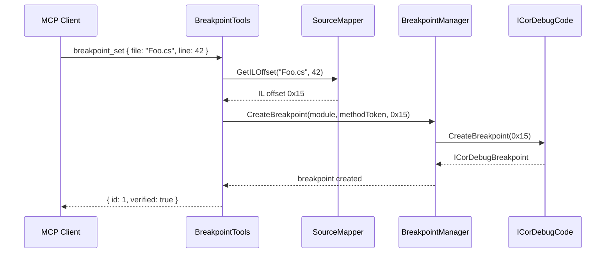
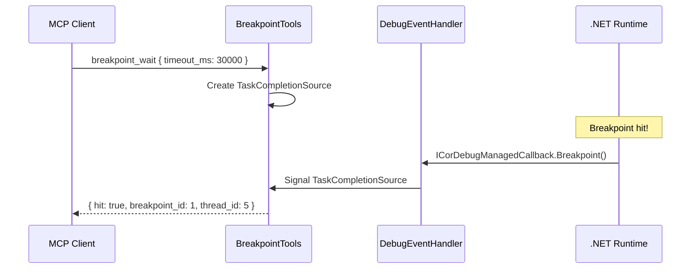
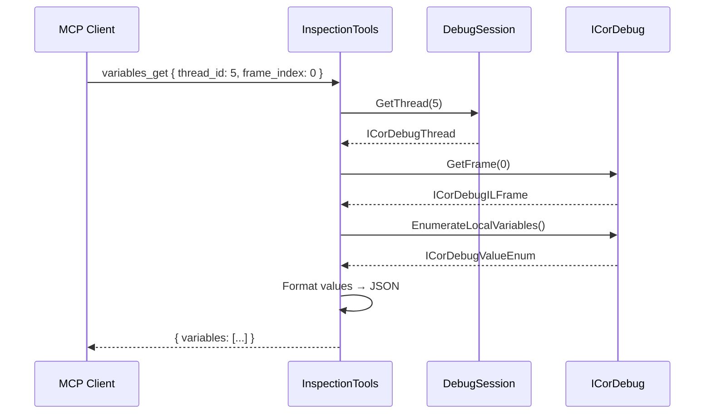
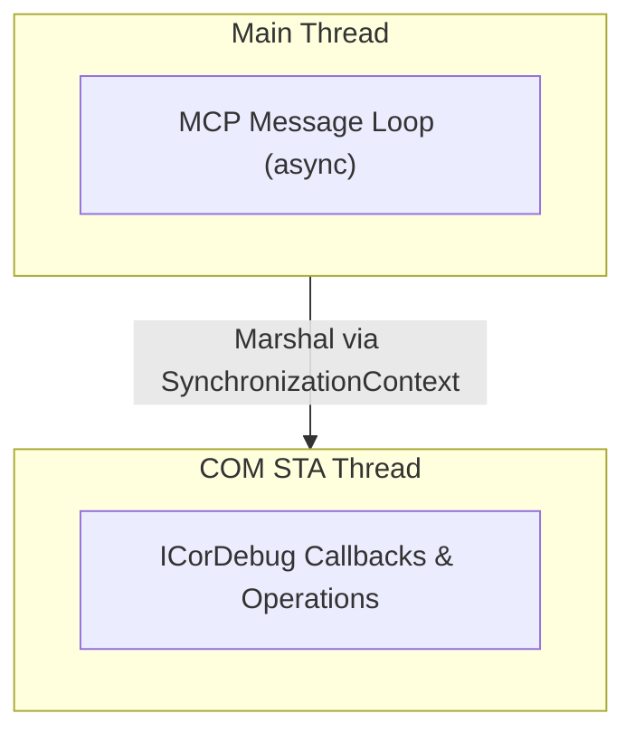

## Overview

DebugMcp is structured as a bridge between the MCP protocol (JSON-RPC over stdio) and the .NET debugging infrastructure (ICorDebug COM APIs).



## Components

### MCP Layer

The MCP layer handles protocol communication and exposes debugging capabilities as MCP tools.

#### Tool Classes

| Class | Responsibility |
|-------|----------------|
| `SessionTools` | Process lifecycle: launch, attach, disconnect, state query |
| `BreakpointTools` | Breakpoint CRUD and waiting for hits |
| `ExecutionTools` | Program flow: continue, pause, stepping |
| `InspectionTools` | Data access: threads, stack, variables, evaluation |

Each tool class:
1. Receives MCP tool calls with JSON parameters
2. Validates input and translates to debugger operations
3. Calls the appropriate Debugger Core methods
4. Formats results as JSON responses

### Debugger Core

The core debugging logic that wraps ICorDebug functionality.

#### DebugSession

Central manager for the debugging session:
- Holds the `ICorDebugProcess` instance
- Tracks session state (running, stopped, at breakpoint)
- Coordinates between components
- Thread-safe state management

```csharp
public class DebugSession
{
    public DebugState State { get; }
    public ICorDebugProcess? Process { get; }

    public Task<int> LaunchAsync(LaunchOptions options);
    public Task AttachAsync(int pid);
    public Task DisconnectAsync();
    public Task ContinueAsync();
    public Task PauseAsync();
    // ...
}
```

#### DebugEventHandler

Implements `ICorDebugManagedCallback` to receive debugging events:
- Breakpoint hits
- Step completions
- Exception throws
- Process exit
- Module loads

Events are converted to async signals that `breakpoint_wait` can await.

#### BreakpointManager

Manages breakpoint lifecycle:
- Creates breakpoints from file:line or method references
- Tracks pending breakpoints (before module loads)
- Maps source locations to IL offsets
- Handles conditional breakpoints

#### ExpressionEvaluator

Evaluates expressions in the context of a stopped thread:
- Uses `ICorDebugEval` to execute code in the debuggee
- Handles complex expressions with method calls
- Returns typed values with proper formatting

#### SourceMapper

Maps between source code and IL:
- Reads PDB/portable PDB symbol files
- Converts source lines to IL offsets (for breakpoints)
- Converts IL offsets to source lines (for stack traces)
- Uses `System.Reflection.Metadata` for portable PDBs

### Infrastructure

#### DbgShimLoader

Handles loading the native dbgshim library:
- Locates dbgshim for the target runtime
- Platform-specific loading (Windows/Linux/macOS)
- Exports `CreateDebuggingInterfaceFromVersion`

#### CorDebugFactory

Creates and initializes ICorDebug instances:
- Calls dbgshim to get `ICorDebug`
- Sets up managed callback handler
- Attaches to or creates processes

## Data Flow Examples

### Setting a Breakpoint



### Waiting for Breakpoint



### Inspecting Variables



## Threading Model

DebugMcp uses a single-threaded apartment (STA) for COM interop with ICorDebug:



## Dependencies

| Package | Purpose |
|---------|---------|
| `ModelContextProtocol` | MCP server implementation |
| `ClrDebug` | Managed ICorDebug wrappers |
| `System.Reflection.Metadata` | PDB reading for source mapping |

## Platform Support

| Platform | dbgshim Source |
|----------|----------------|
| Windows x64 | `Microsoft.Diagnostics.DbgShim.win-x64` NuGet |
| Windows x86 | `Microsoft.Diagnostics.DbgShim.win-x86` NuGet |
| Linux x64 | `Microsoft.Diagnostics.DbgShim.linux-x64` NuGet |
| Linux ARM64 | `Microsoft.Diagnostics.DbgShim.linux-arm64` NuGet |
| macOS x64 | `Microsoft.Diagnostics.DbgShim.osx-x64` NuGet |
| macOS ARM64 | `Microsoft.Diagnostics.DbgShim.osx-arm64` NuGet |
