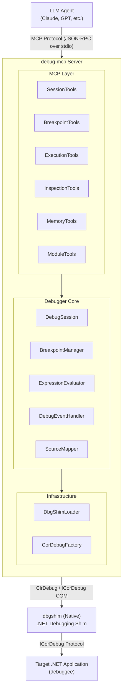
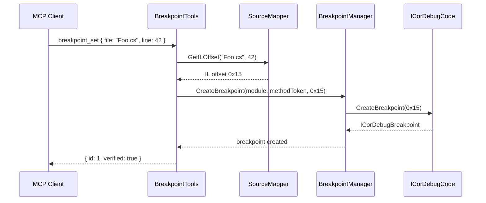
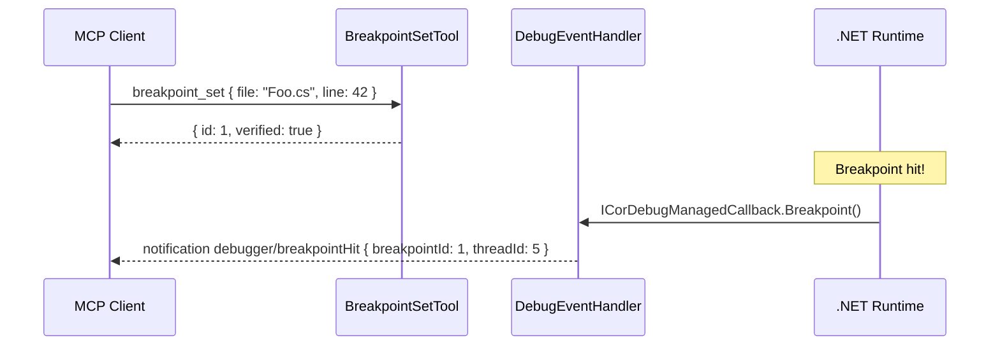
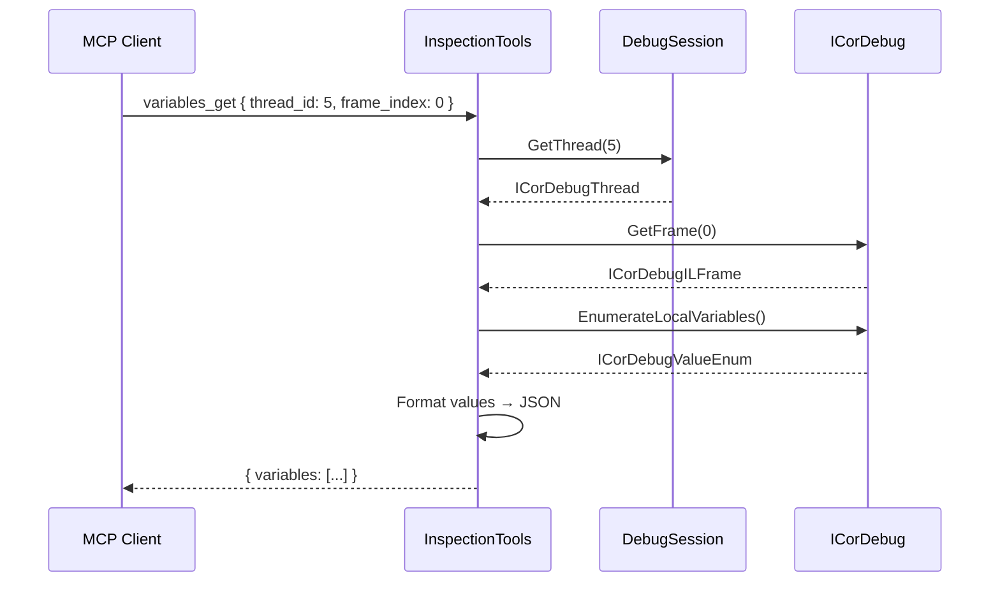
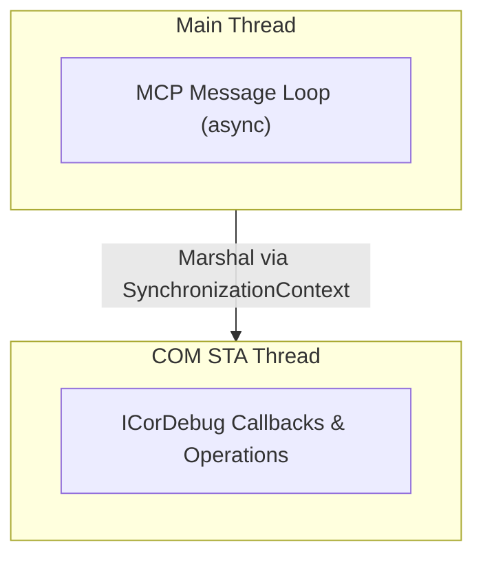
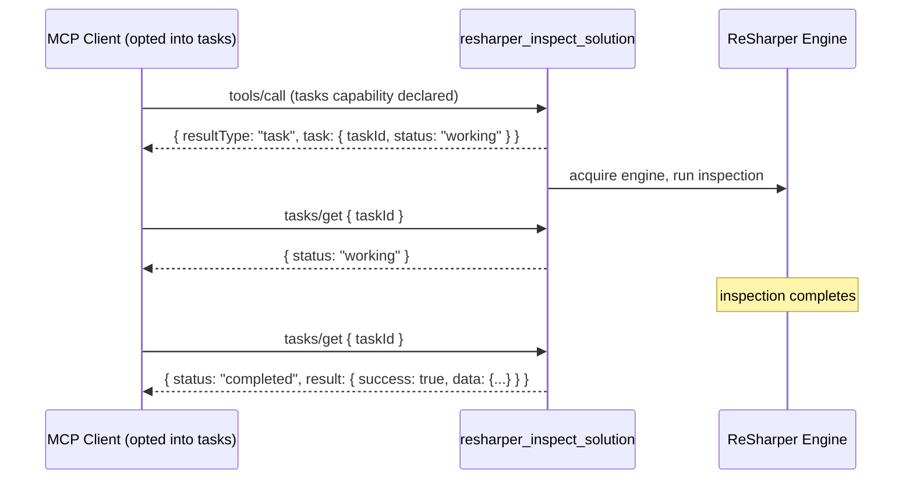

:::info
This page explains how debug-mcp works internally.
You don't need this to use the tool — start with [Getting Started](/docs/getting-started).
:::

## Overview

debug-mcp is structured as a bridge between the MCP protocol (JSON-RPC over stdio) and the .NET debugging infrastructure (ICorDebug COM APIs).


```mermaid
graph TD
    Agent["LLM Agent<br/>(Claude, GPT, etc.)"]
    Agent -->|"MCP Protocol (JSON-RPC over stdio)"| Server

    subgraph Server["debug-mcp Server"]
        direction TB
        subgraph MCP["MCP Layer"]
            ST[SessionTools]
            BT[BreakpointTools]
            ET[ExecutionTools]
            IT[InspectionTools]
            MT[MemoryTools]
            MOT[ModuleTools]
        end
        subgraph Core["Debugger Core"]
            DS[DebugSession]
            BM[BreakpointManager]
            EE[ExpressionEvaluator]
            DEH[DebugEventHandler]
            SM[SourceMapper]
        end
        subgraph Infra["Infrastructure"]
            DSL[DbgShimLoader]
            CDF[CorDebugFactory]
        end
        MCP --> Core
        Core --> Infra
    end

    Server -->|"ClrDebug / ICorDebug COM"| DbgShim["dbgshim (Native)<br/>.NET Debugging Shim"]
    DbgShim -->|"ICorDebug Protocol"| Target["Target .NET Application<br/>(debuggee)"]
```

## Components

### MCP Layer

The MCP layer handles protocol communication and exposes debugging capabilities as MCP tools.

#### Tool Classes

| Class | Responsibility |
|-------|----------------|
| `SessionTools` | Process lifecycle: launch, attach, disconnect, state query |
| `BreakpointTools` | Breakpoint CRUD and waiting for hits |
| `ExecutionTools` | Program flow: continue, pause, stepping |
| `InspectionTools` | Data access: threads, stack, variables, evaluation |

Each tool class:
1. Receives MCP tool calls with JSON parameters
2. Validates input and translates to debugger operations
3. Calls the appropriate Debugger Core methods
4. Formats results as JSON responses

### Debugger Core

The core debugging logic that wraps ICorDebug functionality.

#### DebugSession

Central manager for the debugging session:
- Holds the `ICorDebugProcess` instance
- Tracks session state (running, stopped, at breakpoint)
- Coordinates between components
- Thread-safe state management

```csharp
public class DebugSession
{
    public DebugState State { get; }
    public ICorDebugProcess? Process { get; }

    public Task<int> LaunchAsync(LaunchOptions options);
    public Task AttachAsync(int pid);
    public Task DisconnectAsync();
    public Task ContinueAsync();
    public Task PauseAsync();
    // ...
}
```

#### DebugEventHandler

Implements `ICorDebugManagedCallback` to receive debugging events:
- Breakpoint hits
- Step completions
- Exception throws
- Process exit
- Module loads

Events are converted to async signals that `breakpoint_wait` can await.

#### BreakpointManager

Manages breakpoint lifecycle:
- Creates breakpoints from file:line or method references
- Tracks pending breakpoints (before module loads)
- Maps source locations to IL offsets
- Handles conditional breakpoints

#### ExpressionEvaluator

Evaluates expressions in the context of a stopped thread:
- Uses `ICorDebugEval` to execute code in the debuggee
- Handles complex expressions with method calls
- Returns typed values with proper formatting

#### SourceMapper

Maps between source code and IL:
- Reads PDB/portable PDB symbol files
- Converts source lines to IL offsets (for breakpoints)
- Converts IL offsets to source lines (for stack traces)
- Uses `System.Reflection.Metadata` for portable PDBs

### Infrastructure

#### DbgShimLoader

Handles loading the native dbgshim library:
- Locates dbgshim for the target runtime
- Platform-specific loading (Windows/Linux/macOS)
- Exports `CreateDebuggingInterfaceFromVersion`

#### CorDebugFactory

Creates and initializes ICorDebug instances:
- Calls dbgshim to get `ICorDebug`
- Sets up managed callback handler
- Attaches to or creates processes

## Data Flow Examples

### Setting a Breakpoint


```mermaid
sequenceDiagram
    participant C as MCP Client
    participant BT as BreakpointTools
    participant SM as SourceMapper
    participant BM as BreakpointManager
    participant ICD as ICorDebugCode

    C->>BT: breakpoint_set { file: "Foo.cs", line: 42 }
    BT->>SM: GetILOffset("Foo.cs", 42)
    SM-->>BT: IL offset 0x15
    BT->>BM: CreateBreakpoint(module, methodToken, 0x15)
    BM->>ICD: CreateBreakpoint(0x15)
    ICD-->>BM: ICorDebugBreakpoint
    BM-->>BT: breakpoint created
    BT-->>C: { id: 1, verified: true }
```

### Observing a Breakpoint Hit

There is no `breakpoint_wait` tool — polling was removed in favor of a push notification
(feature 030). The client subscribes once and is told the instant a breakpoint fires, instead of
blocking a request on it:


```mermaid
sequenceDiagram
    participant C as MCP Client
    participant BT as BreakpointSetTool
    participant DEH as DebugEventHandler
    participant CLR as .NET Runtime

    C->>BT: breakpoint_set { file: "Foo.cs", line: 42 }
    BT-->>C: { id: 1, verified: true }
    Note over CLR: Breakpoint hit!
    CLR->>DEH: ICorDebugManagedCallback.Breakpoint()
    DEH-->>C: notification debugger/breakpointHit { breakpointId: 1, threadId: 5 }
```

### Inspecting Variables


```mermaid
sequenceDiagram
    participant C as MCP Client
    participant IT as InspectionTools
    participant S as DebugSession
    participant ICD as ICorDebug

    C->>IT: variables_get { thread_id: 5, frame_index: 0 }
    IT->>S: GetThread(5)
    S-->>IT: ICorDebugThread
    IT->>ICD: GetFrame(0)
    ICD-->>IT: ICorDebugILFrame
    IT->>ICD: EnumerateLocalVariables()
    ICD-->>IT: ICorDebugValueEnum
    IT->>IT: Format values → JSON
    IT-->>C: { variables: [...] }
```

## Threading Model

DebugMcp uses a single-threaded apartment (STA) for COM interop with ICorDebug:


```mermaid
graph TD
    subgraph Main["Main Thread"]
        MCP["MCP Message Loop (async)"]
    end
    subgraph STA["COM STA Thread"]
        ICD["ICorDebug Callbacks & Operations"]
    end
    Main -->|"Marshal via SynchronizationContext"| STA
```

## Cross-Cutting Concerns (MCP Surface Modernization)

Four concerns cut across every tool, layered onto the request/response path described above
rather than living in any single component. See the `specs/069-mcp-surface-modernization/` design
docs in the repository for the full design.

### Progress reporting

Five tools whose work can genuinely take a while — `resharper_inspect_solution`,
`resharper_inspect_project`, `batch_evaluate`, `debug_launch`, `code_load` — report named stages
through the MCP SDK's `IProgress<ProgressNotificationValue>` as they run (e.g. `acquiring engine`
→ `running inspection` → `parsing report` for a ReSharper call). A client that never asked for
progress sees nothing extra — the SDK silently discards reports when no progress token was
supplied, so this degrades structurally rather than conditionally. Every other tool's work
completes fast enough that a stage sequence wouldn't mean anything.

### Deferred results (MCP Tasks)

The same five tools additionally support the MCP Tasks extension: a client that declares the
`tasks` capability gets back a pollable, cancellable handle instead of blocking the request on
the full operation — useful for `resharper_inspect_solution`'s first-run ~180 MB engine download,
or a `batch_evaluate` run against many experiments. A client that doesn't opt in gets the exact
byte-for-byte result it always did; task deferral is negotiated per-request, not a server-wide
mode switch.


```mermaid
sequenceDiagram
    participant C as MCP Client (opted into tasks)
    participant T as resharper_inspect_solution
    participant E as ReSharper Engine

    C->>T: tools/call (tasks capability declared)
    T-->>C: { resultType: "task", task: { taskId, status: "working" } }
    T->>E: acquire engine, run inspection
    C->>T: tasks/get { taskId }
    T-->>C: { status: "working" }
    Note over E: inspection completes
    C->>T: tasks/get { taskId }
    T-->>C: { status: "completed", result: { success: true, data: {...} } }
```

### Typed structured outputs

Every tool method returns a typed C# record (`[McpServerTool(UseStructuredContent = true)]`)
instead of a hand-built JSON string. The MCP SDK derives both the tool's published `outputSchema`
and its `structuredContent` from that return type by reflection — schema and payload can no
longer drift apart, because there is only one source of truth. All 39 tools share one envelope
shape (`{success, ...fields, error?}`), one error shape (`{code, message, details?}`), and where a
result can be arbitrarily large, one truncation shape (`{returned, available, reason}`) — see
[Tools Overview](/docs/tools) for the wire contract.

### Per-call timeouts

Every tool whose work waits on something outside the server's own memory — the debuggee, a build,
a symbol server, the ReSharper engine — accepts an optional timeout parameter with a documented
default (30 seconds, except a handful of tools that already had their own longer or shorter
documented default before this concern existed, which they kept). Exhausting the budget returns a
distinct, documented error naming the elapsed time and leaves the session usable for the next
call — a timeout bounds *waiting*, it never forcibly aborts a step already in flight, so it can
never leave `DebugSession`/`ICorDebug` state inconsistent. Tools that only read already-captured,
in-memory server state (e.g. diffing two existing snapshots) do not accept a timeout at all —
there is nothing external for one to bound.

## Dependencies

| Package | Purpose |
|---------|---------|
| `ModelContextProtocol` | MCP server implementation |
| `ClrDebug` | Managed ICorDebug wrappers |
| `System.Reflection.Metadata` | PDB reading for source mapping |

## Platform Support

| Platform | dbgshim Source |
|----------|----------------|
| Windows x64 | `Microsoft.Diagnostics.DbgShim.win-x64` NuGet |
| Windows x86 | `Microsoft.Diagnostics.DbgShim.win-x86` NuGet |
| Linux x64 | `Microsoft.Diagnostics.DbgShim.linux-x64` NuGet |
| Linux ARM64 | `Microsoft.Diagnostics.DbgShim.linux-arm64` NuGet |
| macOS x64 | `Microsoft.Diagnostics.DbgShim.osx-x64` NuGet |
| macOS ARM64 | `Microsoft.Diagnostics.DbgShim.osx-arm64` NuGet |
